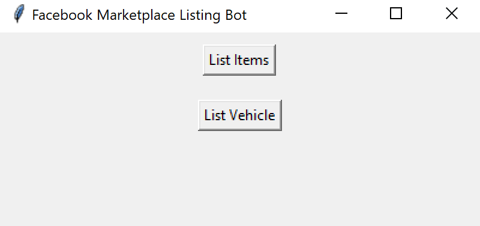

# bot_facebook_marketplace_interface

# Note
This code was forked from GeorgiKeranov, credits to him for the code. Facebook changes the interfaces of its platform occasionally, certain functionalities of the code may then not work exactly as intended. Future user maintaining the code should check GeorgiKeranov's Github repository - Facebook Marketplace as he is still updating the code regularly. Link: https://github.com/GeorgiKeranov/facebook-marketplace-bot 


## Installation
1. You will need to have [Python](https://www.python.org/downloads/) and [pip](https://pip.pypa.io/en/stable/installation/) installed (on Mac they are already installed)
2. You will need to install the following packages with `pip`:
    - Mac commands:
      ```
      pip3 install selenium
      pip3 install webdriver-manager
      ```
    - Linux commands:
      ```
      pip install selenium
      pip install pickle-mixin
      pip install webdriver-manager
      ```
    - Windows commands:
      ```
      python -m pip install selenium
      python -m pip install pickle-mixin
      python -m pip install webdriver-manager
      ```
3. Install the `Google Chrome` browser if you don't have it already - https://www.google.com/chrome/.

## How to Use
1. Open folder where this project is saved on your local machine
2. Open the `csvs` folder
3. Add items or vehicles in the `items.csv` and `vehicles.csv` files. You can open these files with programs like `Microsoft Excel`, `LibreOffice Calc`, etc
4. Please note these things for the csv columns:
	- `Photos Folder` column you will have to define only the folder path for the photos like this:
	    - Windows `C:\Pictures`
	    - Linux/Mac `/Users/myuser/Pictures`
	- `Photos Names` column should only have the names of photos separated with this symbol `;` like this `Photo 1.JPG; Photo 2.png; Photo3.jpg`
	- Marketplace fields that you have to select an option like `Category`, `Condition`, `Vehicle Type`, `Fuel Type`. You have to type the exact name of the option that you want to choose.
	- `Groups` column can have multiple groups and you will have to type their exact name and separate them by this symbol `;`. Example - `Group name 1; Group name 2; Group name`
5. Open terminal inside the main project folder
6. Run main.py with this command:
    - Windows / Linux
        ```
        python main.py
        ```
    - Mac
        ```
        python3 main.py
        ```
7. The first time that you use the program, you will have to log in manually in the browser that have opened. After that the program will log in you automatically using the cookies from the first log in.

8. An additional function added is this interface where you can select which type you want to list, if you want to list them separately. 

